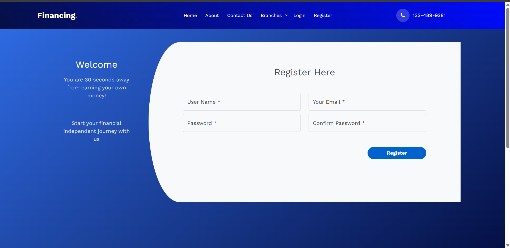
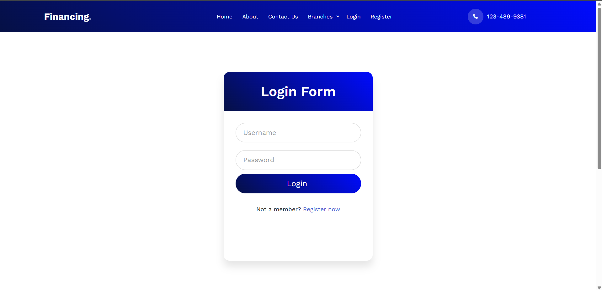
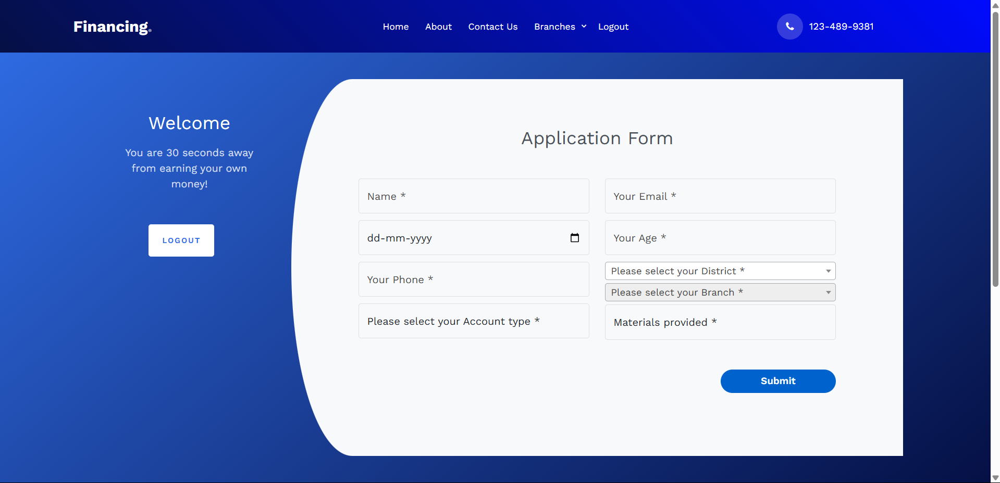

# Banking Sample Application

A sample banking web application built using **Django**. This project simulates basic banking operations like account creation, applying loan.

## 🚀 Features

- User registration and login
- Account creation with different account types
- Applying for loan
- Admin interface for branch/district management
- District & Branch dropdown (relational logic)

---
## 🛠️ Technology Stack

### Backend
- **Language**: [Python 3.13.2]
- **Framework**: [Django]
- **Database**: [SQLite / MySQL (configurable)]
- **Frontend**: [HTML, Bootstrap (Django Templates)]
---
## 🚀 Getting Started

### Installation

1. **Clone the repository**
   ```bash
   git clone https://github.com/harikrishnanap/banking-sample.git
   cd banking-sample
   ```

2. **Create and activate a virtual environment**
   ```bash
   python -m venv env
   source env/bin/activate  # Windows: env\Scripts\activate


3. **Install dependencies**
   ```bash
   pip install -r requirements.txt
   ```

4. **Apply migrations**
   ```bash
   python manage.py makemigrations
   python manage.py migrate
   ```

5. **Run the development server**
   ```bash
   python manage.py runserver
   ```

6. **Visit http://127.0.0.1:8000 in your browser.**

---
### 🚀 Live Demo
  - **🟢 [banking-sample is live here](https://bankingsamp.pythonanywhere.com/)**
---
## 📸 Screenshots

### 🏠 Home Page


###  Register Page


###  Login Page


###  Application Page


---

## 📁 Project Structure

```
banking-sample/
└── banking/
    ├── .idea/             # IDE settings 
    ├── bankapp/           # Django app (models, views, forms, urls)
    ├── bankproject/       # Django project configuration (settings, urls, wsgi)
    ├── credentials/       # Django app
    ├── static/            # Static assets like CSS, JS, images
    ├── templates/         # HTML templates
    ├── .gitignore         # Git ignore file
    ├── manage.py          # Django entry point
    └── requirements.txt   # Python package dependencies
```

## 📞 Contact

**Harikrishnan AP**
- GitHub: [@harikrishnanap](https://github.com/harikrishnanap)
- Email: harihaphari11@gmail.com
- LinkedIn: []
---

**⚠️ Important Note**: This is a sample application for educational and demonstration purposes. It should not be used in production without proper security audits and compliance with financial regulations.
